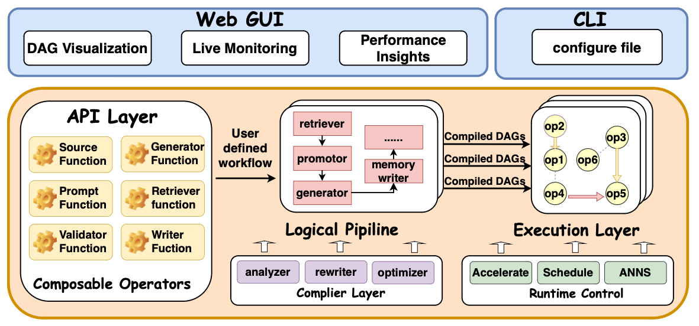

# <div align="center">🧠 SAGE: A Dataflow-Native Framework for LLM Reasoning</div>

<div align="center">

[](https://github.com/intellistream/SAGE/actions/workflows/ci.yml)
[](LICENSE)
[](https://python.org)
[](https://github.com/intellistream/SAGE/issues)
[](https://github.com/intellistream/SAGE/stargazers)

</div>

---

## What is SAGE?

**SAGE** is a dataflow-native framework that transforms how we build and deploy Large Language Model (LLM) reasoning systems by introducing declarative, composable, and transparent AI workflows.

---

## Abstract

Existing LLM-augmented systems suffer from rigid orchestration logic, opaque execution paths, and limited runtime control. SAGE addresses these limitations by introducing a dataflow-centric abstraction that models reasoning workflows as directed acyclic graphs (DAGs) composed of typed operators. This framework enables modular composition of complex reasoning pipelines, unified control and data flow management, native support for stateful operators, and built-in observability for transparent execution monitoring. SAGE bridges the gap between declarative AI application development and efficient distributed execution, providing developers with a systematic approach to building scalable, maintainable, and transparent LLM-powered systems.

---

## The SAGE Framework: Rethinking LLM Application Development

The proliferation of Large Language Models has ushered in a new era of AI applications, from Retrieval-Augmented Generation (RAG) systems to autonomous agents. However, as these systems grow in complexity, developers face increasingly challenging issues: hardcoded orchestration logic that resists modification, opaque execution paths that hinder debugging, and limited runtime control that complicates optimization and scaling.

SAGE addresses these fundamental challenges through a principled dataflow-native approach. Unlike traditional frameworks that treat LLM interactions as sequential function calls, SAGE models reasoning workflows as **Directed Acyclic Graphs (DAGs)** composed of **typed operators**. This paradigm shift enables several key innovations:

### Declarative Composition Over Imperative Orchestration

Traditional LLM applications often suffer from rigid, imperative control flow:

```python
# Traditional approach - rigid and hard to modify
def traditional_rag(query):
    docs = retriever.retrieve(query)
    if len(docs) < 3:
        docs = fallback_retriever.retrieve(query)
    prompt = build_prompt(query, docs)
    response = llm.generate(prompt)
    return response
```

SAGE transforms this into a declarative, composable workflow:

```python
# SAGE approach - declarative and modular
pipeline = (env
    .from_source(QuerySource)
    .map(DenseRetriever, config["retriever"])
    .map(FallbackRetriever, condition="insufficient_results")
    .map(QAPromptor, config["promptor"])
    .map(OpenAIGenerator, config["generator"])
    .sink(ResponseSink)
)
```

This declarative approach separates **what** to compute from **how** to compute it, enabling automatic optimization, parallelization, and fault tolerance.

### Transparent Execution and Observability

SAGE provides built-in observability at every level. The framework automatically instruments execution graphs, tracks operator-level metrics, and provides real-time debugging capabilities:



The integrated dashboard enables developers to:
- **Visualize execution graphs** in real-time with live status updates
- **Monitor resource utilization** across distributed components
- **Debug pipeline behavior** with operator-level profiling
- **Analyze data flow patterns** and identify bottlenecks

### From Local Development to Distributed Deployment

SAGE abstracts away the complexity of distributed execution. The same pipeline code seamlessly transitions from local development to distributed production:

```python
# Development - local execution
env = LocalEnvironment("development")

# Production - distributed execution with Ray
env = RemoteEnvironment("production")

# Same pipeline code works in both environments
pipeline = build_reasoning_pipeline(env)
env.submit(pipeline)
```

---

## 🚀 Quick Start

### Installation

Choose your preferred installation method:

#### Option 1: One-Click Setup (Recommended)
```bash
git clone https://github.com/intellistream/SAGE.git
cd SAGE
./quickstart.sh
```

#### Option 2: PyPI Installation
```bash
# Install core framework
pip install isage

# Install with guided setup
pip install isage && sage-install
```

### Your First SAGE Pipeline

```python
from sage.api.local_environment import LocalEnvironment
from sage.lib.io.source import FileSource
from sage.lib.rag.retriever import DenseRetriever
from sage.lib.rag.promptor import QAPromptor
from sage.lib.rag.generator import OpenAIGenerator
from sage.lib.io.sink import TerminalSink

# Create execution environment
env = LocalEnvironment("first_pipeline")

# Build declarative pipeline
pipeline = (env
    .from_source(FileSource, {"file_path": "questions.txt"})
    .map(DenseRetriever, {"model": "sentence-transformers/all-MiniLM-L6-v2"})
    .map(QAPromptor, {"template": "Answer based on context: {context}\nQ: {query}\nA:"})
    .map(OpenAIGenerator, {"model": "gpt-3.5-turbo"})
    .sink(TerminalSink)
)

# Execute pipeline
env.submit()
```

## 📚 Documentation & Resources

- **📖 Documentation**: [https://intellistream.github.io/SAGE-Pub/](https://intellistream.github.io/SAGE-Pub/)
- **🚀 Examples**: [examples/](./examples/) directory with tutorials and use cases
- **⚙️ Configuration**: [config/](./config/) directory with sample configurations
- **🔧 Installation Guide**: [INSTALL_GUIDE.md](INSTALL_GUIDE.md)

---

## 🤝 Contributing & Support

**Contributing**:
- 🐛 **Bug Reports**: [GitHub Issues](https://github.com/intellistream/SAGE/issues)
- 💡 **Feature Requests**: [GitHub Discussions](https://github.com/intellistream/SAGE/discussions)
- 🚀 **Code Contributions**: Submit pull requests

**Getting Help**:
- 📖 [Troubleshooting Guide](docs/troubleshooting/)
- 💬 [Community Support](https://github.com/intellistream/SAGE/discussions)

---

## 📄 License

SAGE is licensed under the [MIT License](./LICENSE).

---

<div align="center">

**Built with ❤️ by the SAGE Team**

*Transforming AI Application Development*

</div>
